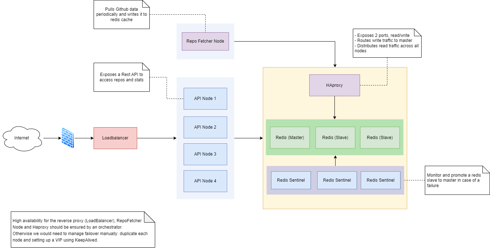

# Github API

## Instructions

* Generate a valid Github token and execute the command below.
* A token is required to make more than 60 requests per hour.
* Application will be then running on port `5000`

```
GITHUB_TOKEN=xxxxxxxxxxxxx docker compose up
```

### OpenAPI TL;DR
```
GET http://localhost:5000/repos?language=ruby&owner=wycats&limit=1
GET http://localhost:5000/stats?language=ruby
```

## Design decisions

This solution represents a prototype and does not reflect the final architecture, as it is challenging to implement within a tight time box.

The first design decision I faced was finding the best spot to pull Github data. There are generally two choices: either do it in the `/repos` handler or run a job periodically to fetch the data.

I went with the second option. Fetching external data in a handler is not scalable; it might work for 100 repositories but will certainly timeout for a larger dataset.

Additionally, if Github goes down, the HTTP requests will timeout, causing excessive latency.

Using a standalone job to fetch data outside of the API service eases maintenance, even if Github becomes unreachable, the API service can still serve outdated cached data.

### Caching

I've implemented an in-memory store to cache data pulled from github as well as handlers responses, this store is meant to be replaced by a redis one.

The key-value store implements two interfaces: Reader and Writer. This separation allows for write requests to be forwarded to the master, and read requests to be directed to slaves.

## Leftovers

- Currently, the fetcher job runs within the same process as the API service, it should be moved to its own process and run from a dedicated node.
- The fetcher doesn't use any rate-limit to request data, it should have one to avoid being blocked/rate-limited by Github in case we want to load more than 100 repositories.
- Find a way to get the latest repositories instead of the oldest ones: I didn't find any way to achieve this.
- Store the repository's `updatedAt` field and do not refetch its language if it is up to date.

## Final architecture


